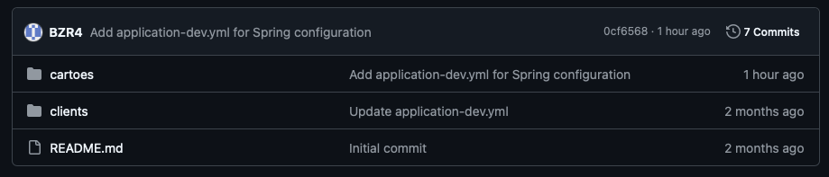

# Micro-Serviço Avaliador de Crédito

## Criação do Micro-Serviço

1. Crie o microservico `avaliadorms` no diretório `microservices`com as dependencias:
 - Spring Web;
 - Spring JPA;
 - H2;
 - Spring Dev Tools;
 - Postgres ou MySQL;
 - Lombok;
 - Spring Cloud Config Client;
 - Spring Cloud Netflix Eureka Client;

## Inclua o projeto à configuraçoes do Gradle como subprojeto

1. No arquivo `settings.gradle` da raiz do projeto adicione a linha abaixo:

```gradle
include 'microservices:avaliadorms'
```

## Inclua o projeto ao balanceamento de carga

1. No arquivo `application.yml`do projeto `edge-server` adicione a linha abaixo:

```yaml
server:
  port: 8765

spring:
  application:
    name: edgeserver
  cloud:
    gateway:
      server:
        webflux:
          discovery:
            locator:
              enabled: true
              lower-case-service-id: true
          routes:
            - id: avaliadorms
              uri: lb://avaliadorms
              predicates:
                - Path=/avaliacoes-credito/**
```

O arquivo deverá ficar assim:

```yml
server:
  port: 8765

spring:
  application:
    name: edgeserver
  cloud:
    gateway:
      server:
        webflux:
          discovery:
            locator:
              enabled: true
              lower-case-service-id: true
          routes:
            - id: clientms
              uri: lb://clientms
              predicates:
                - Path=/clientes/**
            - id: cartoesms
              uri: lb://cartoesms
              predicates:
                - Path=/cartoes/**
            - id: avaliadorms
              uri: lb://avaliadorms
              predicates:
                - Path=/avaliacoes-credito/**
eureka:
  client:
    register-with-eureka: true
    fetch-registry: true
    service-url:
      defaultZone: http://localhost:8761/eureka
management:
  endpoints:
    web:
      exposure:
        include: "*"
  endpoint:
    health:
      show-details: always
```

## Inclua as configurações de config server e eureka localmente

1. No arquivo `application.yml`do projeto `avaliadorms` adicione a linha abaixo:

```yaml
spring:
  application:
    name: avaliadorms
  config:
    import: optional:configserver:http://localhost:8888
  cloud:
    config:
      profile: test
```

### Inclua as configurações de eureka

1. No arquivo `application.yml`do projeto `avaliadorms` adicione a linha abaixo:

```yaml
eureka:
  client:
    serviceUrl:
      defaultZone: http://localhost:8761/eureka/
    initialInstanceInfoReplicationIntervalSeconds: 5
    registryFetchIntervalSeconds: 5
  instance:
    leaseRenewalIntervalInSeconds: 5
    leaseExpirationDurationInSeconds: 5
```

## Inclua as configurações dos profiles no seu GitHub

> Lembre-se que as configurações dos profiles devem ser feitas no seu GitHub, como no exemplo abaixo:



### Inclua as novas configurações no search-path do config server

1. No arquivo `application.yml`do projeto `configserver` adicione a linha abaixo:

```yaml
spring:
  cloud:
    config:
      server:
        git:
          uri: https://github.com/seu-usuario/seu-config-server.git
          search-paths: 
           - clients
           - cartoes
           - avaliador
```


## Crie os DTOs do pacote seu-usuario.avaliadorms.domain.dtos

1. No projeto `avaliadorms` crie um novo pacote chamado `seu-usuario.avaliadorms.domain.dtos`
2. Crie os seguintes DTOs:
- CartaoDTO
- CartaoClienteDTO
- CartaoAprovadoDTO
- DadosAvaliacaoDTO
- DadosClienteDTO
- DadosSolicitacaoEmissaoCartaoDTO
- ProtocoloSolicitacaoCartaoDTO
- RetornoAvaliacaoClienteDTO
- SituacaoClienteDTO


### CartaoDTO

```java
package seu-usuario.avaliadorms.domain.dtos;

import lombok.Data;

import java.math.BigDecimal;

@Data
public class CartaoDTO {
    private Long id;
    private String nome;
    private String bandeira;
    private BigDecimal limiteBasico;
}
```

### CartaoClienteDTO

```java
package seu-usuario.avaliadorms.domain.dtos;

import lombok.Data;

@Data
public class CartaoClienteDTO {
    private String nome;
    private String bandeira;
    private BigDecimal limiteLiberado;
}
```

### CartaoAprovadoDTO

```java
package seu-usuario.avaliadorms.domain.dtos;

import lombok.Data;

@Data
public class CartaoAprovadoDTO {
    private String cartao;
    private String bandeira;
    private BigDecimal limiteAprovado;
}
```

### DadosAvaliacaoDTO

```java
package seu-usuario.avaliadorms.domain.dtos;

import lombok.Data;

@Data
public class DadosAvaliacaoDTO {
    private String cpf;
    private Long renda;
}
```

### DadosClienteDTO

```java
package seu-usuario.avaliadorms.domain.dtos;

import lombok.Data;

@Data
public class DadosClienteDTO {
    private Long id;
    private String nome;
    private Integer idade;
}
```

### DadosSolicitacaoEmissaoCartaoDTO

```java
package seu-usuario.avaliadorms.domain.dtos;

import lombok.Data;

import java.math.BigDecimal;

@Data
public class DadosSolicitacaoEmissaoCartaoDTO {
    private Long idCartao;
    private String cpf;
    private String endereco;
    private BigDecimal limiteLiberado;
}
```

### ProtocoloSolicitacaoCartaoDTO

```java
package seu-usuario.avaliadorms.domain.dtos;

import lombok.AllArgsConstructor;
import lombok.Data;

@Data
@AllArgsConstructor
public class ProtocoloSolicitacaoCartaoDTO {
    private String protocolo;
}
```

### RetornoAvaliacaoClienteDTO

```java
package seu-usuario.avaliadorms.domain.dtos;

import lombok.AllArgsConstructor;
import lombok.Data;

import java.util.List;

@Data
@AllArgsConstructor
public class RetornoAvaliacaoClienteDTO {
    private List<CartaoAprovadoDTO> cartoes;
}
```

### SituacaoClienteDTO

```java
package seu-usuario.avaliadorms.domain.dtos;

import lombok.AllArgsConstructor;
import lombok.Builder;
import lombok.Data;
import lombok.NoArgsConstructor;

import java.util.List;

@Data
@AllArgsConstructor
@NoArgsConstructor
@Builder
public class SituacaoClienteDTO {
    private DadosClienteDTO cliente;
    private List<CartaoClienteDTO> cartoes;
}
```
