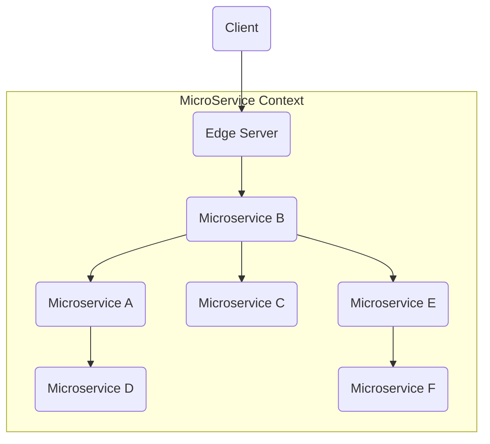

# Edge Server

Muitas vezes nós estruturamos micro serviços que centralizem o acesso externo, protegendo serviços externos; por exemplo, um e-commerce possui uma infra-estrutura distribuiída e escalável, porém o ponto acesso às operações é único, protegendo seu variados micro-serviços que o constituem, este é o Design Pattern **Edge Server**.



> O Edge Server atua como um proxy reverso e é integrado ao **Servvice Discovery** para prover o balanceamento de carga.

# Criando o Edge Server

1. Dentro do diretorio `spring-cloud` crie um projeto Spring com a dependencias: * `Actuator` e `Gateway`;
3. Renomeie o arquivo `main\resources\application.properties` para `application.yml`;
4. No arquivo `application.yml` inclua as configurações.

```yml
server:
  port: 8765

spring:
  application:
    name: edge-server
  cloud:
    gateway:
      server:
        webflux:
          discovery:
            locator:
              enabled: true
              lower-case-service-id: true

eureka:
  client:
    service-url:
      defaultZone: http://localhost:8761/eureka
    fetch-registry: true
    register-with-eureka: true

```

> Acima configuramos a porta padrão do servidor e ativamos a busca e registro para com o Service Discovery

## Criando o roteamento e balanceamento de carga.

Agora que nossos microserviços estão devidamente registrados ao **Eureka Server**, vamos configurar o balanceamento de carga para nossos mricr-serviços.

### Configurando o Load Balancer

> Nesta seção, configuramos a captura das requisições ao micro serviço **clientms** para com o end-point **/clients/**, assim todas as requisições para este end-point serão balanceadas para as instancias dos micro serviços  disponíveis. Como temos 3 instancias, cada instancia receberá uma parte da carga das requisições.

O arquivo final ficará desta forma.

```yml
server:
  port: 8765

spring:
  application:
    name: edge-server
  cloud:
    gateway:
      server:
        webflux:
          discovery:
            locator:
              enabled: true
              lower-case-service-id: true

eureka:
  client:
    service-url:
      defaultZone: http://localhost:8761/eureka
    fetch-registry: true
    register-with-eureka: true
```

#### Configurando o roteamento via Java

> Crie o pacote config e crie o Bean abaixo; ele far'a o roteamento das requisicoes para o micro-service clientms.

```java
import org.springframework.cloud.gateway.route.RouteLocator;
import org.springframework.cloud.gateway.route.builder.RouteLocatorBuilder;
import org.springframework.context.annotation.Bean;
import org.springframework.context.annotation.Configuration;

@Configuration
public class ApiGatewayConfiguration {
    @Bean
    public RouteLocator getRouter(RouteLocatorBuilder builder) {
        return builder
                .routes()
                .route("clientms", p -> p.path("/clients/**").uri("lb://clientms"))
                .build();
    }

}
```

> Em outro momento iremos realizar as configuracoes de roteamento via .YML.

#### Inicie o Edge Server e confirme seu status no Eureka Service Discovery.


### Alterando o ClientMS Service

Precisamos ajustar os ids e as portas dos micro serviços dos clients para serem roteados e balanceados.

1. Para todas instancias de **product-service**;
2. Remova o **id** e o número de porta **0** do `application.yml`, conform o exemplo abaixo:

```yml
spring:
  application:
    name: clientms

eureka:
  client:
    serviceUrl:
      defaultZone: http://localhost:8761/eureka/
    initialInstanceInfoReplicationIntervalSeconds: 5
    registryFetchIntervalSeconds: 5
  instance:
    leaseRenewalIntervalInSeconds: 5
    leaseExpirationDurationInSeconds: 5  
    # instance-id: ${spring.application.name}:${spring.application.instance_id:${random.value}}
    
# server:
  # port: 0
```

> Voce pode comentar ou remover, em outro momento iremos fixar as portas quando até entrarmos em detalhes sobre o Docker.

# Testando o balanceamento de carga

Neste ponto temos o seguinte cenário:
* Eureka ativo;
* Edge Server ativo;

Precisamos subir 3 instancias do microverviço, realizar várias requisições e validar se elas foram balanceadas para os 3 micro serviços.

## Subindo as instancias

Você precisará de 6 terminais em baerto para realizar os testes, então siga os steps abaixo atentamente.

1. Para todas os projetos;
2. Inicialize o **Service Discovery**, no primeiro terminal, a partir da raiz do `eureka-server`;
```yml
.\gradlew bootRun
```
3. Inicialize o **Edge Server**, no segundo terminal, a partir da raiz do `edgeserver`;
```yml
.\gradlew bootRun
```
4. Inicialize a **Primeira Instancia de Product Service**, no terceiro terminal, a partir da raiz do `clientms`;
```yml
.\gradlew bootRun --args='--server.port=8001'
```
5. Inicialize a **Segunda Instancia de Product Service**, no quarto terminal, a partir da raiz do `clientms`;
```yml
.\gradlew bootRun --args='--server.port=8002'
```
6. Inicialize a **Terceira Instancia de Product Service**, no quinto terminal, a partir da raiz do `clientms`;
```yml
.\gradlew bootRun --args='--server.port=8003'
```

## Validando o balanceamento

No sexto terminal, iremos disparar as requisições; então será necessário um pouco de destreza para enviar pelo menos umas 20 requisições o mais rápido que puder e verificar o **IP** retornado por cada uma das instancias.

### Resultado esperado

Como resultado, é esperado que enviemos todas as requisições para a url `http://localhost:8765/clients` e que as 3 instancias retornem o processamento das requisições, você poderá conferir pelo número da porta que a requisição retornou.

```shell
curl "http://localhost:8765/clients"
{"uuid":"479d0607-d598-42ee-a475-3257d923c3e2","name":"Client e478f44b-8abf-4186-a185-319802efc972","email":"vip@client.com","address":"server port: 8001"}

curl "http://localhost:8765/clients"
{"uuid":"479d0607-d598-42ee-a475-3257d923c3e2","name":"Client e478f44b-8abf-4186-a185-319802efc972","email":"vip@client.com","address":"server port: 8002"}

curl "http://localhost:8765/clients"
{"uuid":"479d0607-d598-42ee-a475-3257d923c3e2","name":"Client e478f44b-8abf-4186-a185-319802efc972","email":"vip@client.com","address":"server port: 8003"}

curl "http://localhost:8765/clients"
{"uuid":"479d0607-d598-42ee-a475-3257d923c3e2","name":"Client e478f44b-8abf-4186-a185-319802efc972","email":"vip@client.com","address":"server port: 8001"}

curl "http://localhost:8765/clients"
{"uuid":"479d0607-d598-42ee-a475-3257d923c3e2","name":"Client e478f44b-8abf-4186-a185-319802efc972","email":"vip@client.com","address":"server port: 8002"}

curl "http://localhost:8765/clients"
{"uuid":"479d0607-d598-42ee-a475-3257d923c3e2","name":"Client e478f44b-8abf-4186-a185-319802efc972","email":"vip@client.com","address":"server port: 8003"}
```

# Configurando o MonoRepo

Na raiz da pasta `ldmp_microservices` voce precisará incluir alguns arquivos gradle para poder tratar as dependencias do MonoRepo.

1. Copie os arquivos listados abaixo do projeto `clientms`:
* Diretório gradle;
* Arquivp gradlew;
* Arquivo gradlew.bat;
* Arquivo settings.gradle;

2. Edite o arquivo settings.gradle e adicione os projetos abaixo:

```gradle
rootProject.name = 'ldmp_microservices'
include 'spring-cloud:eureka-server'
include 'spring-cloud:edge-server'
include 'microservices:clientms'
```
3. Clique no logo do Gradle e selecione a opção `Refresh`;
4. Compile os projetos a partir da raiz ldmp_microservices:
```gradle
./gradlew build
```
 
 5. Abra a Guia de Services e execute as seguintes ações;
 * Edite a configuração ClientmsApplication;
 * Renomeie-a para ClientmsApplication1;
 * Clique em `Modify options` e adicione a opção `Add VM Options`;
 * Adicione a opção `-Dserver.port=8001`;

 6. Crie um cópia de ClientmsApplication1 e renomeie-a para ClientmsApplication2;
 * Altere a opção `-Dserver.port=8002`;

 7. Crie um cópia de ClientmsApplication2 e renomeie-a para ClientmsApplication3;
 * Altere a opção `-Dserver.port=8003`;
 
 ## Inciando os projetos pela IDE.

 Agora voce pode inicializar os projetos pela IDE ao invés dos terminais.


